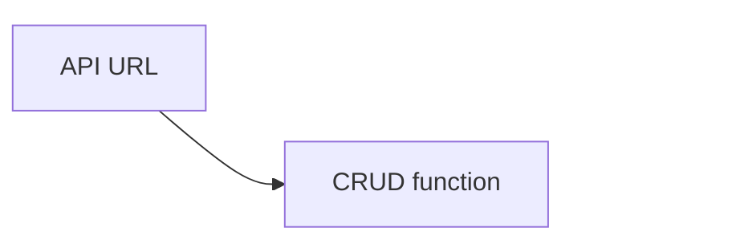
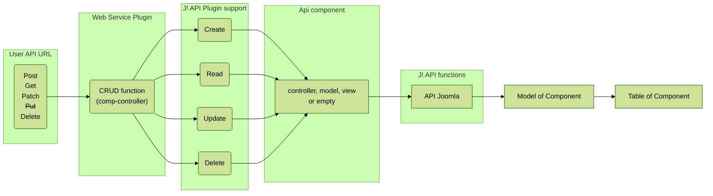
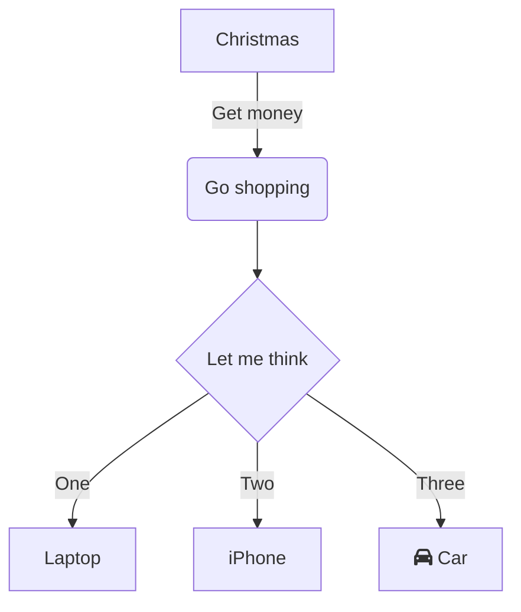
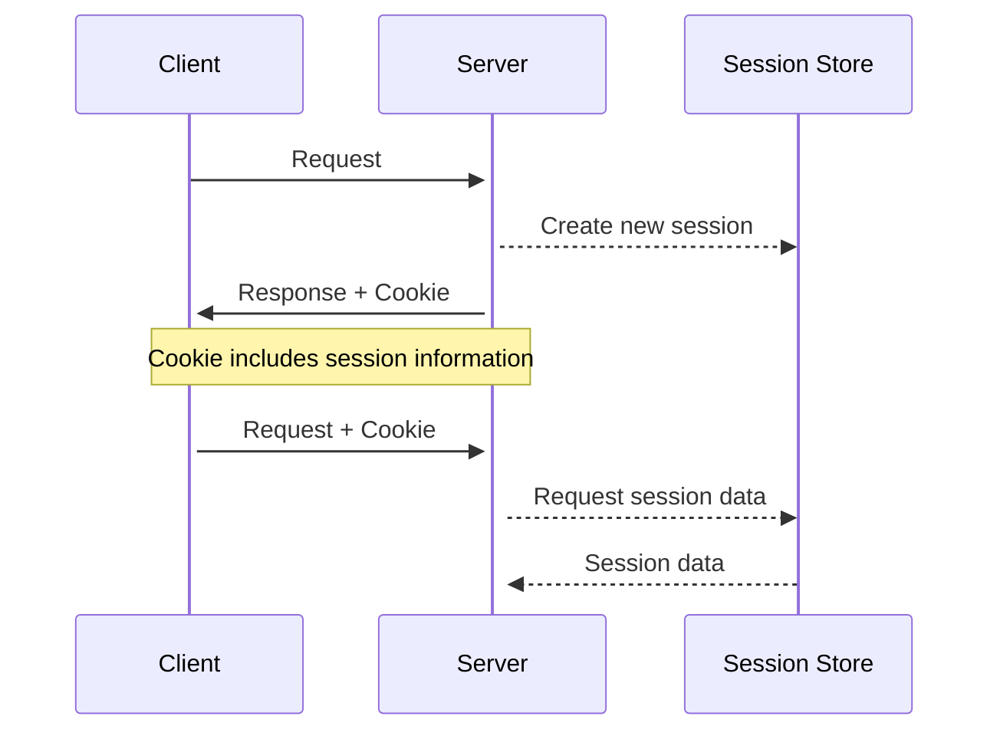
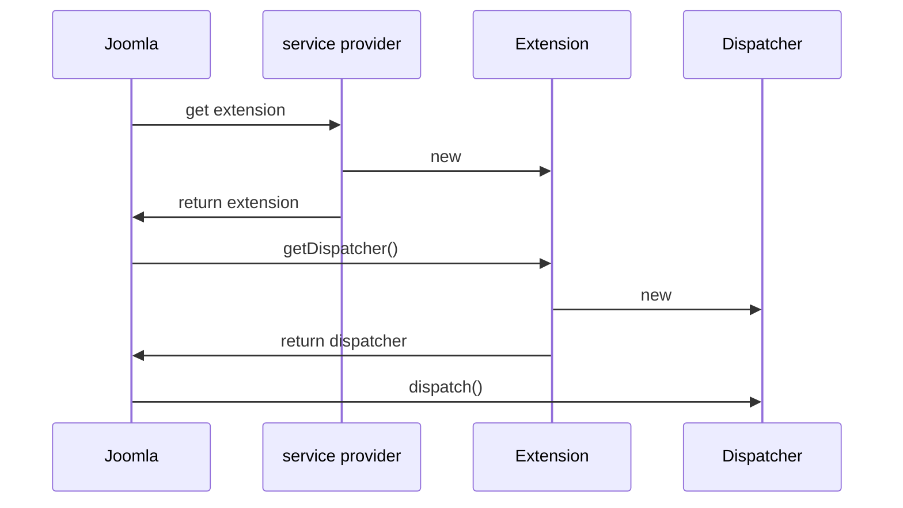
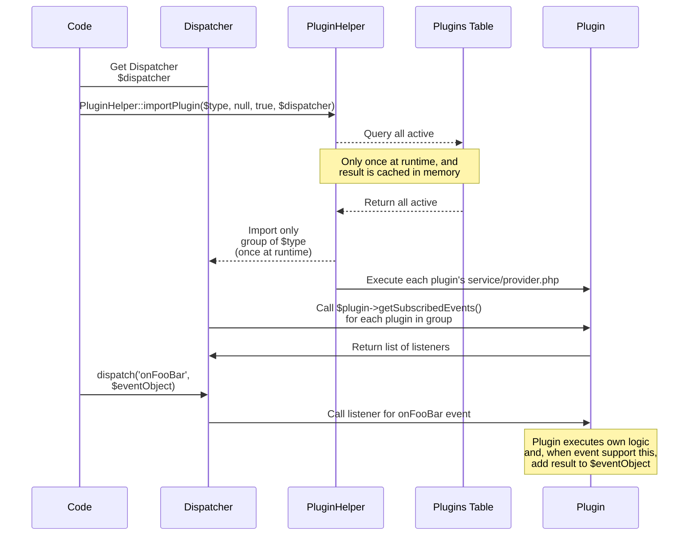
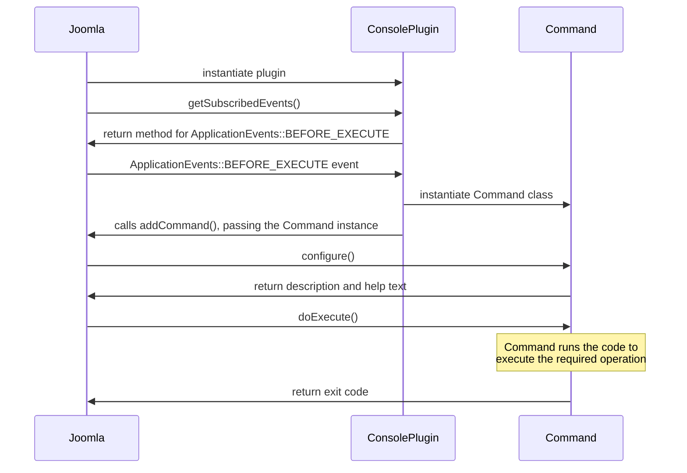
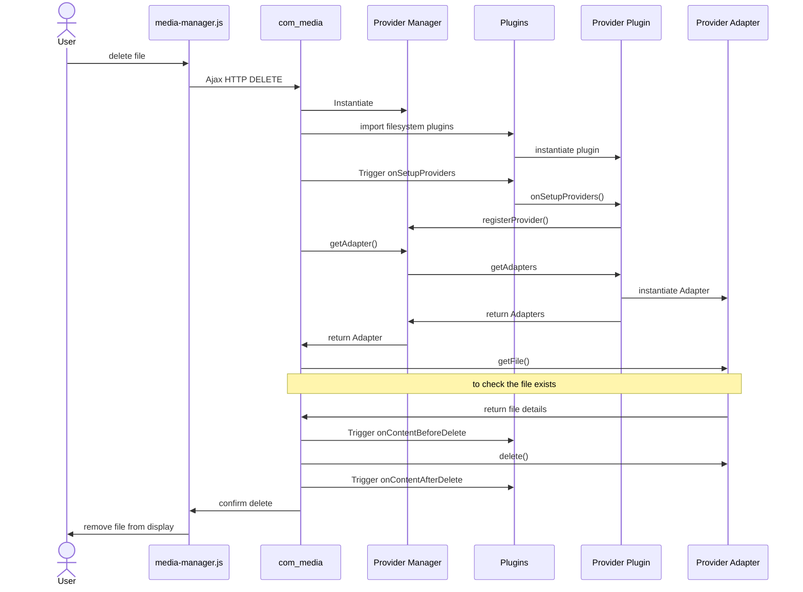

```mermaid
%%{init:{"theme":"forest"}, flowchart:{"curve": "linear"}}%%
%% linkStyle default interpolate basis
flowchart LR
start[API URL]  ~~~|" "| start --> plg[CRUD function] ~~~|" "| plg
```



```mermaid
%%{init:{"theme":"forest"}}%%
%% linkStyle default interpolate basis
flowchart LR

    subgraph userAPIroute["User API URL"]
		start("Post
			Get
			Patch
			<s>Put</s>
			Delete
		")
	end
	
    start --> plg

    subgraph WebServicePlugin["Web Service Plugin"]
		plg("CRUD function <br>(comp-controller)")
	end
	
        plg --> create
        plg --> read 
        plg --> update 
        plg --> delete 

    subgraph ApiPluginSupport["J! API Plugin support"]
        create("Create")
        read("Read")
        update("Update")
        delete("Delete")
	end
	
        create --> apiComp
        read --> apiComp
        update --> apiComp
        delete --> apiComp

    subgraph ApiComponentController["Api component"]
        
        apiComp["controller, model, view <br> or empty"]

    end

    subgraph CRUD_Operations["J! API functions"]
	
        apiComp --> apiJoomla

    end


    apiJoomla["API Joomla"]	-->
	modelComponent["Model of Component"] -->
	tableComponent["Table of Component"] 

```


----


```mermaid
graph TD
  %% Set edges to be curved (try monotoneX for a nice alternative)
  linkStyle default interpolate basis
  A[Christmas] -->|Get money| B(Go shopping)
  B --> C{Let me think}
  C -->|One| D[Laptop]
  C -->|Two| E[iPhone]
  C -->|Three| F[fa:fa-car Car]
```


```



```mermaid
sequenceDiagram
    Client->>+Server: Request
    Server-->>Session Store: Create new session
    Server->>+Client: Response + Cookie
    Note over Client,Server: Cookie includes session information
    Client->>+Server: Request + Cookie
    Server-->>Session Store: Request session data
    Session Store-->>Server: Session data
```


```mermaid
sequenceDiagram
Joomla->>service provider:get extension
service provider->>Extension:new
service provider->>Joomla:return extension
Joomla->>Extension:getDispatcher()
Extension->>Dispatcher:new
Extension->>Joomla:return dispatcher
Joomla->>Dispatcher:dispatch()
```



```mermaid
sequenceDiagram
    Code->Dispatcher: Get Dispatcher <br>$dispatcher
    Code->>PluginHelper: PluginHelper::importPlugin($type, null, true, $dispatcher)
    PluginHelper-->>Plugins Table: Query all active
    Note over PluginHelper, Plugins Table: Only once at runtime, and <br>result is cached in memory
    Plugins Table-->>PluginHelper: Return all active
    PluginHelper-->>Dispatcher: Import only <br>group of $type <br>(once at runtime)
    PluginHelper->>Plugin: Execute each plugin's service/provider.php
    Dispatcher->>Plugin: Call $plugin->getSubscribedEvents() <br>for each plugin in group
    Plugin->>Dispatcher: Return list of listeners
    Code->>Dispatcher: dispatch('onFooBar', <br>$eventObject)
    Dispatcher->>Plugin: Call listener for onFooBar event
    Note over Plugin: Plugin executes own logic <br>and, when event support this, <br>add result to $eventObject
```

---

```mermaid
sequenceDiagram
Joomla->>ConsolePlugin:instantiate plugin
Joomla->>ConsolePlugin:getSubscribedEvents()
ConsolePlugin->>Joomla:return method for ApplicationEvents::BEFORE_EXECUTE
Joomla->>ConsolePlugin:ApplicationEvents::BEFORE_EXECUTE event
ConsolePlugin->>Command:instantiate Command class
ConsolePlugin->>Joomla:calls addCommand(), passing the Command instance
Joomla->>Command:configure()
Command->>Joomla:return description and help text
Joomla->>Command:doExecute()
Note over Command:Command runs the code to <br>execute the required operation
Command->>Joomla:return exit code
```



```mermaid
sequenceDiagram
actor User
User->>media-manager.js:delete file
media-manager.js->>com_media:Ajax HTTP DELETE
com_media->>Provider Manager:Instantiate
com_media->>Plugins:import filesystem plugins
Plugins->>Provider Plugin:instantiate plugin
com_media->>Plugins:Trigger onSetupProviders
Plugins->>Provider Plugin:onSetupProviders()
Provider Plugin->>Provider Manager:registerProvider()
com_media->>Provider Manager:getAdapter()
Provider Manager->>Provider Plugin:getAdapters
Provider Plugin->>Provider Adapter:instantiate Adapter
Provider Plugin->>Provider Manager:return Adapters
Provider Manager->>com_media:return Adapter
com_media->>Provider Adapter:getFile()
Note over com_media, Provider Adapter: to check the file exists
Provider Adapter->>com_media:return file details
com_media->>Plugins:Trigger onContentBeforeDelete
com_media->>Provider Adapter:delete()
com_media->>Plugins:Trigger onContentAfterDelete
com_media->>media-manager.js:confirm delete
media-manager.js->>User:remove file from display
```


