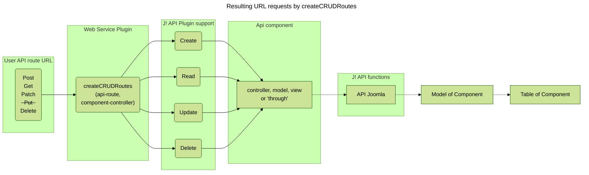

### Internal routes created by createCRUDRoutes 

The following graph shows the path of possible API route inside the joomla code. 
The **webservice plugin** of the component calls the J! API function **createCRUDRoutes** 
and gives it the base route definition and the component controller base.


It is called in the form 
```php
$router->createCRUDRoutes(  
    'v1/secondhand/books',  
    'books',  
    $defaults  
);  
```
where the first argument is the route and the second the base (controller...) name.  
The `$defaults` variable looks either like  
```php $defaults = ['component' => 'com_secondhand', 'public' => false];```  
or  
```php $defaults = ['component' => 'com_secondhand', 'public' => true];```  
if set  **'public' => true** no X-Token will be checked and everyone can access this entry.
This should only be set for tests

#### createCRUDRoutes function

The joomla API code provides now all the CRUD entries. 
This leads to following API entry points 

```
Get    http://127.0.0.1/web_page/api/index.php/v1/secondhand/books 
Get    http://127.0.0.1/web_page/api/index.php/v1/secondhand/books/:id 
Post   http://127.0.0.1/web_page/api/index.php/v1/secondhand/books { params }
Patch  http://127.0.0.1/web_page/api/index.php/v1/secondhand/books/:id { params }
Delete http://127.0.0.1/web_page/api/index.php/v1/secondhand/books/:id
```
Please note that the "Put" route is unavailable and was therefore crossed out above in the graph.

The joomla createCRUDRoutes function organizes it as following: 

```php
 public function createCRUDRoutes($baseName, $controller, $defaults = [], $publicGets = false)
    {
        $getDefaults = array_merge(['public' => $publicGets], $defaults);

        $routes = [
            new Route(['GET'], $baseName, $controller . '.displayList', [], $getDefaults),
            new Route(['GET'], $baseName . '/:id', $controller . '.displayItem', ['id' => '(\d+)'], $getDefaults),
            new Route(['POST'], $baseName, $controller . '.add', [], $defaults),
            new Route(['PATCH'], $baseName . '/:id', $controller . '.edit', ['id' => '(\d+)'], $defaults),
            new Route(['DELETE'], $baseName . '/:id', $controller . '.delete', ['id' => '(\d+)'], $defaults),
        ];

        $this->addRoutes($routes);
    }
```

The Route function is the standard function to define a route. It needs the 'task' (method), the route starting with "v1/..." and the controller.function.
Additional in the $default parameter the component name and the 'public' variables are expected.   

That could have been written instead as 

```
new Route(['GET'],    'v1/secondhand/books',     'books.displayList', [], $getDefaults),
new Route(['GET'],    'v1/secondhand/books/:id', 'books.displayItem', ['id' => '(\d+)'], $getDefaults),
new Route(['POST'],   'v1/secondhand/books',     'books.add',         [], $defaults),
new Route(['PATCH'],  'v1/secondhand/books/:id', 'books.edit',        ['id' => '(\d+)'], $defaults),
new Route(['DELETE'], 'v1/secondhand/books/:id', 'books.delete',      ['id' => '(\d+)'], $defaults),
```
There is a named check for route 'variables' example 'v1/secondhand/books/**2**'.  
The naming had two aspects: ```['id' => '(\d+)']``` 
1) The name can later be accessed as standard input parameter 'name'->'value' $input->getInt('id')
2) Behind is a regex expression which shall check for valid/invalid characters 
There may be other types too: ```['component_name' => '([A-Za-z0-9_]+)']``` 

TIP: By the way the json parameters given in the request can be fetched by 
```php $data = json_decode($this->input->json->getRaw(), true); ``` or ```php $srcFilename  = $this->input->json->getString('filename');```

#### Forwarding to the controller

The middle part of the route definition tells about the 'controller.function' call:
`new Route(['GET'],    'v1/secondhand/books',     'books.displayList', [], $getDefaults)`  
Here ```'books.displayList'``` tells the controller name is 'books' and the function to be implemented is "displayList".

This is the entry point in the API part of the component. The code above will lead to file BooksController.php. Path to file see below.

### API part of the component

The controller and view structure to implement
```
api\components\com_secondhand\  
├─── src  
     ├─── Controller  
     │    └─── BooksController.php  
     └─── View  
          └─── Books  
               └─── JsonapiView.php  
```

The API path starts in the root of the web page

#### Controller file (reminder)

```php
    protected $contentType = 'books';
    protected $default_view = 'books';
```
The `$contentType` tells which component model to use and the `$default_view` tells which json api view is used to render the collected data.

#### Json Api View file (reminder)

```php
    protected $fieldsToRenderItem = ['id', 'title', 'alias', 'isbn', 'description', 'note', 'published', 'created', 'created_by', 'modified', 'modified_by',];
    protected $fieldsToRenderList = ['id', 'title', 'alias', 'isbn', 'description', 'note', 'published', 'created', 'created_by', 'modified', 'modified_by',];
```

