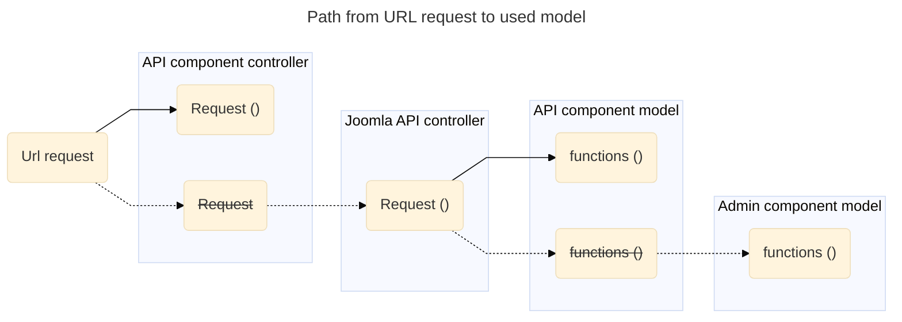
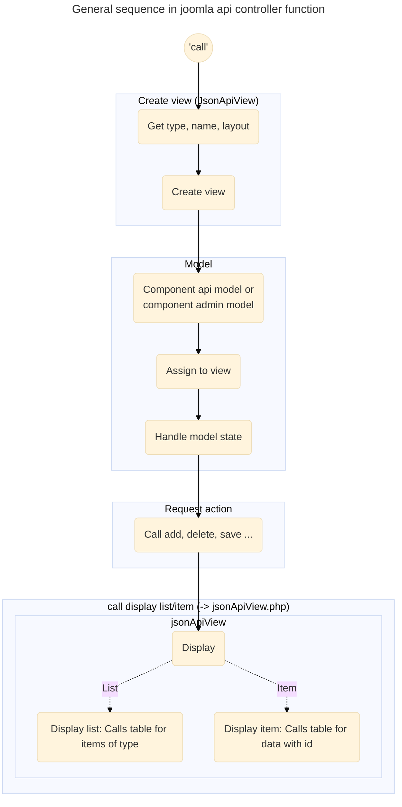

### Code workflows 

#### URL request to used model

The API call to the controller function like 'displayList' will use the code in the component api controller path if available. 
Otherwise, the default API controller steps in and handles the request. 
In similar way the joomla api controller calls the model creator which tries to find the component api model 
or takes the component administrator model with given name.

#### joomla api controller sequence

by  Joomla API base classes

List of CRUD controller functions called: 'displayList','displayItem','add','edit (patch)', 'delete'

? Overview diagramm :
comp. control function ? base model or direct model ...

================================
### Workflow get (Item) -> displayItem()

(get with ID on end of route)

================================
### Workflow get (list) -> displayList()

(get with ID on end of route)

================================
### Workflow post -> add()

================================
### Workflow patch -> edit()

================================
### Workflow delete -> delete()

================================
