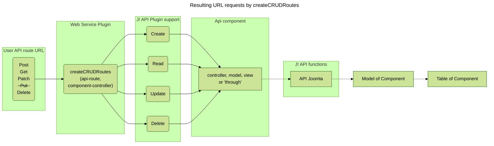
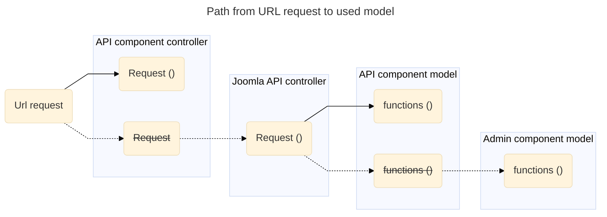
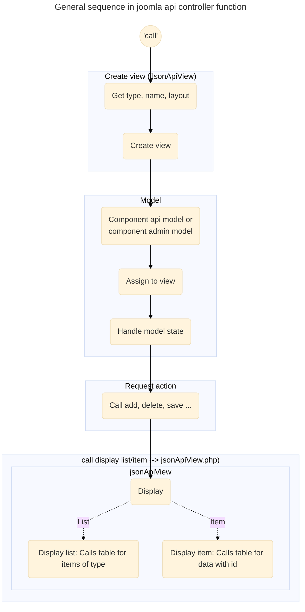

<h2 style="text-align:center;">API demo with minimum component</h2>
<span style="text-align:center;">Version 2026.07.22</span>

[//]: # (!INCLUDE "tableOfContent.md")
[//]: # (---)

## Bare minimum component / webservice API
Following is a description of a bare minimum component with matching minimum webservice API. 

## Component "com_secondhand"

Imagine a second hand books component with just the one books table and matching view. 

Table items
* id
* name
* author
* isbn
* Standard items like publish, created, ...

The idea is to use of an external scan the ISBN of the book, fetch book data by other web API and use a J! web API to fill this table.

## Web Services API plugin plg_webservices_secondhand

### The general base component folder structure:

```
plg_secondhand  
├─── language  
│      └─── en-GB  
│              ├─── plg_content_secondhand.ini  
│              └─── plg_content_secondhand.sys.ini  
├─── services  
│      └─── provider.php  
├─── src  
│      └─── Extension  
│              └─── Secondhand.php  
└─── secondhand.xml
```
The general folder structure is similar to each other API base structure.
The file src->Extension->Secondhand.php will hold the API definition, whereas all other folders and files support the API event interception.

### Manifest file

`secondhand.xml`
You probably know the structure of a manifest file so following is a excerpt.
```xml
<?xml version="1.0" encoding="utf-8"?>
<extension type="plugin" group="webservices" method="upgrade">
  <name>plg_webservices_secondhand</name>
  <creationDate>2026.05.26</creationDate>
  ...
  <license>GNU General Public License version 2 or later; see LICENSE.txt</license>
  <description>PLG_WEBSERVICES_SECONDHAND_XML_DESCRIPTION</description>
  <namespace path="src">Bluebox\Plugin\WebServices\Secondhand</namespace>
  <files>
    <folder plugin="secondhand">services</folder>
    <folder>language</folder>
    <folder>services</folder>
    <folder>src</folder>
    <file>secondhand.xml</file>
  </files>
  
  <api>
    <files folder="api">
      <folder>src</folder>
    </files>
  </api>
  
  ...
  <updateservers>...</updateservers>
</extension>
```
The group is 'webservices'.
Attention: The namespace contains 'WebSpaces' with an uppercase 'S' in te middle

The Manifest file gets an additional section 

```XML
  <api>
    <files folder="api">
      <folder>src</folder>
    </files>
  </api>
```

### Language constants
In language->en_GB folder the usual two files are expected: 
- plg_webservices_secondhand.ini
- plg_webservices_secondhand.sys.ini

Which contains:
```ini
PLG_WEBSERVICES_SECONDHAND="webservice secondhand"
PLG_WEBSERVICES_SECONDHAND_XML_DESCRIPTION="webservice for component secondhand"
```
Please prefix 'PLG_WEBSERVICES' to the constant name SECONDHAND.
### service provider 

```services/provider.php```

Here the secondhand API definition class is instantiated and listed as a service provider.
```php
/**
 * @package   ....
 */

\defined('_JEXEC') or die;

use Joomla\CMS\Extension\PluginInterface;  
use Joomla\CMS\Factory;  
use Joomla\CMS\Plugin\PluginHelper;  
use Joomla\DI\Container;  
use Joomla\DI\ServiceProviderInterface;  
use Bluebox\Plugin\WebServices\Secondhand\Extension\Secondhand;  
  
return new class () implements ServiceProviderInterface{  
    /**  
     * Registers the service provider with a DI container.    
     * @param   Container  $container  The DI container.  
     * @return  void  
     * @since   0.1.0     */    
    public function register(Container $container): void  
    {  
        $container->set(  
            PluginInterface::class,  
            $container->lazy(Secondhand::class, function (Container $container) {  
                $plugin = new Secondhand(  
                    (array) PluginHelper::getPlugin('webservices', 'secondhand')  
                );  
                $plugin->setApplication(Factory::getApplication());  
  
                return $plugin;  
            })  
        );  
    }  
};
```
### Route extension class

```src\Extension\Secondhand.php```

```php
/**  
 * @package ... */  
namespace Bluebox\Plugin\WebServices\Secondhand\Extension;  
  
use Joomla\CMS\Event\Application\BeforeApiRouteEvent;  
use Joomla\CMS\Plugin\CMSPlugin;  
use Joomla\Event\SubscriberInterface;  
  
\defined('_JEXEC') or die;  
/**  
 * Joomla! Webservices Plugin webservice secondhand. 
 * @since  0.1.0 */
final class Secondhand extends CMSPlugin implements SubscriberInterface  
{  
    /**  
     * Returns an array of events this subscriber will listen to.     
     * @return  array  
     * @since   5.1.0     */    
    public static function getSubscribedEvents(): array  
    {  
        return ['onBeforeApiRoute' => 'onBeforeApiRoute',];  
    }  
  
    /**  
     * Registers com_secondhand API's routes in the application     
     * @param   BeforeApiRouteEvent  $event  The event object  
     * @return  void  
     * @since   4.0.0     */    
    public function onBeforeApiRoute(BeforeApiRouteEvent $event): void  
    {  
        $router = $event->getRouter();  
  
        $defaults = ['component' => 'com_secondhand'];  
        // ToDo: Remove when tests finished, enables access without token  
        // $getDefaults = array_merge(['public' => true], $defaults);  
        $getDefaults = array_merge(['public' => false], $defaults);  
  
        $router->createCRUDRoutes(  
            'v1/secondhand/books',  
            'books',  
            $getDefaults  
        );  
    }  
}
```

**function getSubscribedEvents**

Here the function onBeforeApiRoute is assigned to the API event list

**function onBeforeApiRoute**

Here the magic happens with call to createCRUDERoutes. This is a function provided by Joomla which supports 'CRUD' (Create, Read, Update; Delete) 
API routes to call over HTTP

The first parameter ```php  'v1/secondhand/books' ``` tell the route which can be used in the call to the web page. 'v1' 
is used as the version, 'secondhand' is the component and 'books' are the items.
The second parameter is the controller to be used. The last is the internal config parameter 
which defines the actual component to be used and how 'public' the API is reachable.

This does not look like much but the matching 'controller', 'model' and view are supported in the component.

## Component "com_secondhand" API additions

We have to add code into the joomla root API folder. 

### Manifest

Section 'API' is added as separate branch parallel to ```<administrator>```

```xml
  <api>
    <files folder="api">
      <folder>src</folder>
    </files>
  </api>
```
It follows the standard form sections are handled. It just tells where to find the root of files ...


### API part of the component

#### The API sub folder structure:

From the root of the joomla web page
```
api\components\com_secondhand\  
├─── src  
     ├─── Controller  
     │    └─── BooksController.php  
     └─── View  
          └─── Books  
               └─── JsonapiView.php  
```
Attention the API folder structure is similar to other component structures with the exception that the controller folder keeps all ```nnnController.php``` files without further subdirectories
The view code is always kept in a JsonapiView.php file in a named folder 

#### Controller in API part

 ```BooksController.php```

```php
/**
 * @package   ....
 */

namespace Bluebox\Component\Secondhand\Api\Controller;

use Joomla\CMS\Filter\InputFilter;
use Joomla\CMS\Helper\TagsHelper;
use Joomla\CMS\MVC\Controller\ApiController;
use Joomla\Component\Fields\Administrator\Helper\FieldsHelper;

// phpcs:disable PSR1.Files.SideEffects
\defined('_JEXEC') or die;
// phpcs:enable PSR1.Files.SideEffects

/**
 * The books controller
 *
 * @since  4.0.0
 */
class BooksController extends ApiController
{
    /**
     * The content type of the item.
     *
     * @var    string
     * @since  4.0.0
     */
    protected $contentType = 'books';

    /**
     * The default view for the display method.
     *
     * @var    string
     * @since  3.0
     */
    protected $default_view = 'books';


    // Implement other methods like read, update, delete as needed
}
```

Within the minimal controller, two definitions need to be implemented, as the controller class inherits from ApiController.

```php
    protected $contentType = 'books';
    protected $default_view = 'books';
```

The `$contentType` tells which component model to use and the `$default_view` tells which view is given the collected data does render.

#### View in API part

```JsonapiView.php```

```php
<?php

/**
 * @package   ....
 */

namespace Bluebox\Component\Secondhand\Api\View\Books;

use Joomla\CMS\Factory;
use Joomla\CMS\Helper\TagsHelper;
use Joomla\CMS\Language\Multilanguage;
use Joomla\CMS\MVC\View\JsonApiView as BaseApiView;
use Joomla\CMS\Plugin\PluginHelper;
use Joomla\Component\Fields\Administrator\Helper\FieldsHelper;
use Joomla\Registry\Registry;
use Secondhand\Component\Secondhand\Api\Helper\SecondhandHelper;
use Secondhand\Component\Secondhand\Api\Serializer\SecondhandSerializer;

\defined('_JEXEC') or die;

/**
 * The books view
 *
 * @since  4.0.0
 */
class JsonapiView extends BaseApiView
{
    /**
     * The fields to render item in the documents
     *
     * @var  array
     * @since  4.0.0
     */
    protected $fieldsToRenderItem = [
        'id',
        'title',
        'alias',
        'isbn',
        'description',

        'note',
        'published',
        'created', 
        'created_by',
        'modified', 
        'modified_by',
    ];

    /**
     * The fields to render items in the documents
     *
     * @var  array
     * @since  4.0.0
     */
    protected $fieldsToRenderList = [        
        'id',
        'title',
        'alias',
        'isbn',
        'description',

        'note',
        'published',
        'created', 
        'created_by',
        'modified', 
        'modified_by',
    ];

}
```

Inside the minimum controller there are two variables to implement as the JsonapiView class inherits from BaseApiView.

The code needs to know which variables should be displayed when rendering item or list data.
This may define different data for items and list view. The BaseApiView matches the retrieved data from the tables against the list defined here and displays the matching names items.

```php
    protected $fieldsToRenderItem = [
        'id', 
        'title',
        'alias',
        'isbn',
        'description',
        'note', 'published', 'created', 'created_by', 'modified', 'modified_by',
    ];

    protected $fieldsToRenderList = [
        'id',
        'title',
        'alias',
        'isbn',
        'description',
        'note', 'published', 'created', 'created_by', 'modified', 'modified_by',
    ];
```

### Resumee:

This is it. The last two files (`BooksController.php`, `JsonapiView.php`) with the support of the joomla api base classes is all what is needed to support basic table data

---

## API route definitions created

We are not much wiser now so what can be done with the code ?

The CRUDE definitions result in following API routes:

<xdetails>
 <summary><code>GET v1/secondhand/books</code> <code><b>/</b></code> <code>(lists all books with variables)</code></summary>

##### Parameters

> None

##### Responses

> | http code     | content-type                      | response                                                              |
> |---------------|-----------------------------------|-----------------------------------------------------------------------|
> | `200`         | `application/json;charset=UTF-8`  | ```json {"type": "books","id": "2","attributes": {"id": 2,"title": "Why We Sleep","alias": "why-we-sleep",, ...}``` |

##### Example CURL

> ```batch
> curl -s --show-error  -X GET "http://127.0.0.1/web_page/api/index.php/v1/secondhand/books" -H "Content-Type: application/json" -H "X-Joomla-Token:  ..."
> ```

##### Example http

> ```http
> ###
> GET http://127.0.0.1/web_page/api/index.php/v1/secondhand/books
> Accept: application/vnd.api+json
> Content-Type: application/json
> X-Joomla-Token:  ...
> ```

</xdetails>

<xdetails>
 <summary><code>GET v1/secondhand/books/:id</code> <code><b>/</b></code> <code>(lists variables of book)</code></summary>

##### Parameters

> None

##### Responses

> | http code     | content-type                      | response                                                                                                                    |
> |---------------|-----------------------------------|-----------------------------------------------------------------------------------------------------------------------------|
> | `200`         | `application/json;charset=UTF-8`        | ```json {"type": "books","id": "2","attributes": {"id": 2,"title": "Why We Sleep","alias": "why-we-sleep",, ... }``` |

##### Example CURL

> ```batch
> curl -s --show-error  -X GET "http://127.0.0.1/web_page/api/index.php/v1/secondhand/books/1" -H "Content-Type: application/json" -H "X-Joomla-Token:  ..."
> ```

##### Example http

> ```http
> ###
> GET http://127.0.0.1/web_page/api/index.php/v1/secondhand/books/1
> Accept: application/vnd.api+json
> Content-Type: application/json
> X-Joomla-Token:  ...
> ```
</xdetails>

<xdetails>
 <summary><code>POST secondhand/books</code> <code><b>/</b></code> <code>(creates new book with data)</code></summary>

##### Parameters

> | name                | type    | data type    | description |
> |---------------------|---------|--------------|-------------|
> | all book parameters | %       | Json, string |             | 


##### Responses

> | http code     | content-type                      | response                                                                                                                   |
> |---------------|-----------------------------------|----------------------------------------------------------------------------------------------------------------------------|
> | `200`         | `application/json;charset=UTF-8`  | ```json {"type": "books", "id": "2", "attributes": { "id": 1, "asset_id": 105, "title": "Global Configuration", ... }``` |

##### Example cURL

> ```shell
> curl -s --show-error  -X POST "http://127.0.0.1/web_page/api/index.php/v1/secondhand/books" -d "{\"title\":\"My book\",\"isbn\":\"12-3456-78-90\",\"author\":\"john breeze\",\"description\":\"The next book i write\",\"published\":1}"  -H "Content-Type: application/json" -H "X-Joomla-Token:  ..."
> ```

##### Example http

> ```http
> ###
> POST http://127.0.0.1/web_page/api/index.php/v1/secondhand/books
> Accept: application/vnd.api+json
> Content-Type: application/json
> X-Joomla-Token: 
> 
> {
>    "title": "My book",
>    "isbn": "12-3456-78-90",
>    "author": "john breeze",
>    "description": "The next book i write",
>    "published": 1
> }
> ```

</xdetails>

<xdetails>
 <summary><code>PATCH secondhand/books/:id</code> <code><b>/</b></code> <code>(writes parameters into selected book)</code></summary>

##### Parameters

> | name  |  type     | data type               | description                                                           |
> |-------|-----------|-------------------------|-----------------------------------------------------------------------|
> | title |  %     | string   |  | 
> | isbn  |  %     | string   |  | 
> | ...   |  %     | string   |   |

##### Responses

> | http code     | content-type                      | response                                                            |
> |---------------|-----------------------------------|---------------------------------------------------------------------|
> | `200`         | `application/json;charset=UTF-8`        | ```json {"type": "books", "id": "2", "attributes": { "id": 1, "asset_id": 105, "title": "Global Configuration", ... }``` |

##### Example cURL

> ```shell
> curl -s --show-error  -X PATCH "http://127.0.0.1/web_page/api/index.php/v1/secondhand/1/books" -d "{\"published\":-2,\"isbn\":\"1234-4567-8890\"} "  -H "Content-Type: application/json" -H "X-Joomla-Token:  ..."
> ```

##### Example http

> ```http
> ###
> PATCH http://127.0.0.1/web_page/api/index.php/v1/secondhand/books/1
> Accept: application/vnd.api+json
> Content-Type: application/json
> X-Joomla-Token: 
> 
> {
>     "published": -2,
>     "isbn": "1234-4567-8890",
> }
> ```
</xdetails>

<xdetails>
 <summary><code>DELETE secondhand/books/:id</code> <code><b>/</b></code> <code>(deletes selected book)</code></summary>

Just a reminder: Delete needs trash state before. use patch with "published": -2, (see above)

##### Parameters

> None

##### Responses

> None

##### Example cURL

> ```shell
> curl -s --show-error  -X DELETE  "http://127.0.0.1/web_page/api/index.php/v1/secondhand/books/2" -H "Content-Type: application/json" -H "X-Joomla-Token:  ..."
> ```

##### Example http

> ```http
> ###
> DELETE http://127.0.0.1/web_page/api/index.php/v1/secondhand/books/2
> Accept: application/vnd.api+json
> Content-Type: application/json
> X-Joomla-Token: 
> ```
</xdetails>


### Calling API routes results

The results are json style and contain the links to actual call and next, previous and last page

#### get book

```json
{
  "links": {
    "self": "http://127.0.0.1/api_6x/api/index.php/v1/secondhand/books/1"
  },
  "data": {
    "type": "books",
    "id": "1",
    "attributes": {
      "id": 1,
      "title": "test 01",
      "alias": "test-01",
      "isbn": "1234567890",
      "description": "",
      "published": 1,
      "created": "2026-05-24 17:23:19",
      "created_by": 775,
      "modified": "2026-05-24 17:42:09",
      "modified_by": 775,
      "note": ""
    }
  }
}
```

#### get books

```json
{
    "links": {
        "self": "http://127.0.0.1/api_6x/api/index.php/v1/secondhand/books"
    },
    "data": [
        {
            "type": "books",
            "id": "2",
            "attributes": {
                "id": 2,
                "title": "Why We Sleep",
                "alias": "why-we-sleep",
                "isbn": "da1b2048-cec2-4127-950e-35bc4b3ee181",
                "description": "Sleep is one of the most important aspects of our life, health and longevity and yet it is increasingly neglected in twenty-first-century society, with devastating consequences- every major disease in the developed world - Alzheimer - s, cancer, obesity, diabetes - has very strong links to deficient sleep. In this book, the first of its kind written by a scientific expert, Professor Matthew Walker explores twenty years of cutting-edge research to solve the mystery of why sleep matters. Looking at creatures from across the animal kingdom as well as major human studies, Why We Sleep delves in to everything from what really happens in our brains and bodies when we dream to how caffeine and alcohol affect sleep and why our sleep patterns change across a lifetime, transforming our appreciation of the extraordinary phenomenon that safeguards our existence.",
                "published": 1,
                "created": "2026-05-27 09:53:06",
                "created_by": 776,
                "modified": "2026-05-27 09:53:06",
                "modified_by": 776,
                "note": ""
            }
        },
        {
            "type": "books",
            "id": "3",
            "attributes": {
                "id": 3,
                "title": "My book",
                "alias": "my-book",
                "isbn": "12-3456-78-90",
                "description": "The next book i write",
                "published": 1,
                "created": "2026-06-23 11:40:16",
                "created_by": 776,
                "modified": "2026-06-23 11:40:16",
                "modified_by": 776,
                "note": ""
            }
        }
    ],
    "meta": {
        "total-pages": 1
    }
}
```

#### post book

```json
{
    "links": {
        "self": "http://127.0.0.1/api_6x/api/index.php/v1/secondhand/books"
    },
    "data": {
        "type": "books",
        "id": "3",
        "attributes": {
            "id": 3,
            "title": "My book",
            "alias": "my-book",
            "isbn": "12-3456-78-90",
            "description": "The next book i write",
            "published": 1,
            "created": "2026-06-23 11:40:16",
            "created_by": 776,
            "modified": "2026-06-23 11:40:16",
            "modified_by": 776,
            "note": ""
        }
    }
}
```


#### patch book trash ("published": -2)

```json
{
    "links": {
        "self": "http://127.0.0.1/api_6x/api/index.php/v1/secondhand/books/4"
    },
    "data": {
        "type": "books",
        "id": "4",
        "attributes": {
            "id": 4,
            "title": "My book",
            "alias": "my-book-7",
            "isbn": "12-3456-78-90",
            "description": "The next book i write",
            "published": -2,
            "created": "2026-05-26 16:25:09",
            "created_by": 776,
            "modified": "2026-05-26 16:41:17",
            "modified_by": 776,
            "note": ""
        }
    }
}
```

#### Example with Joomla configuration (application) using poge offset 

Add ?page[offset]=90&page[limit]=30' to the route in the form hsown in the response. 
The response contains to the route links for called (self), first , previous and last  

```json
{
    "links": {
        "self": "http://127.0.0.1/api_6x/api/index.php/v1/config/application?page%5Boffset%5D=30&page%5Blimit%5D=30",
        "first": "http://127.0.0.1/api_6x/api/index.php/v1/config/application?page%5Boffset%5D=0&page%5Blimit%5D=30",
        "previous": "http://127.0.0.1/api_6x/api/index.php/v1/config/application?page%5Boffset%5D=0&page%5Blimit%5D=30",
        "next": "http://127.0.0.1/api_6x/api/index.php/v1/config/application?page%5Boffset%5D=60&page%5Blimit%5D=30",
        "last": "http://127.0.0.1/api_6x/api/index.php/v1/config/application?page%5Boffset%5D=90&page%5Blimit%5D=30"
    },
    "data": [
        {
            "type": "application",
            "id": "247",
            "attributes": {
                "helpurl": "https://help.joomla.org/proxy?keyref=Help{major}{minor}:{keyref}&lang={langcode}",
                "id": 247
            }
        },
        {
            "type": "application",
            "id": "247",
            "attributes": {
                "offset": "UTC",
                "id": 247
            }
        },
        {
            "type": "application",
            "id": "247",
            "attributes": {
                "cors": false,
                "id": 247
            }
        },
        {
            "type": "application",
            "id": "247",
            "attributes": {
                "mailer": "mail",
                "id": 247
            }
        },
        {
            "type": "application",
            "id": "247",
            "attributes": {
                "sendmail": "/usr/sbin/sendmail",
                "id": 247
            }
        },
        {
            "type": "application",
            "id": "247",
            "attributes": {
                "smtpauth": false,
                "id": 247
            }
        },
        
        ...............        
        
    ],
    "meta": {
        "total-pages": 4
    }
}
```
---

## What is going on behind the scene ?

### Internal routes created by createCRUDRoutes 

The following graph shows the path of possible API route inside the joomla code. 
The **webservice plugin** of the component calls the J! API function **createCRUDRoutes** 
and gives it the base route definition and the component controller base.


It is called in the form 
```php
$router->createCRUDRoutes(  
    'v1/secondhand/books',  
    'books',  
    $defaults  
);  
```
where the first argument is the route and the second the base (controller...) name.  
The `$defaults` variable looks either like  
```php $defaults = ['component' => 'com_secondhand', 'public' => false];```  
or  
```php $defaults = ['component' => 'com_secondhand', 'public' => true];```  
if set  **'public' => true** no X-Token will be checked and everyone can access this entry.
This should only be set for tests

#### createCRUDRoutes function

The joomla API code provides now all the CRUD entries. 
This leads to following API entry points 

```
Get    http://127.0.0.1/web_page/api/index.php/v1/secondhand/books 
Get    http://127.0.0.1/web_page/api/index.php/v1/secondhand/books/:id 
Post   http://127.0.0.1/web_page/api/index.php/v1/secondhand/books { params }
Patch  http://127.0.0.1/web_page/api/index.php/v1/secondhand/books/:id { params }
Delete http://127.0.0.1/web_page/api/index.php/v1/secondhand/books/:id
```
Please note that the "Put" route is unavailable and was therefore crossed out above in the graph.

The joomla createCRUDRoutes function organizes it as following: 

```php
 public function createCRUDRoutes($baseName, $controller, $defaults = [], $publicGets = false)
    {
        $getDefaults = array_merge(['public' => $publicGets], $defaults);

        $routes = [
            new Route(['GET'], $baseName, $controller . '.displayList', [], $getDefaults),
            new Route(['GET'], $baseName . '/:id', $controller . '.displayItem', ['id' => '(\d+)'], $getDefaults),
            new Route(['POST'], $baseName, $controller . '.add', [], $defaults),
            new Route(['PATCH'], $baseName . '/:id', $controller . '.edit', ['id' => '(\d+)'], $defaults),
            new Route(['DELETE'], $baseName . '/:id', $controller . '.delete', ['id' => '(\d+)'], $defaults),
        ];

        $this->addRoutes($routes);
    }
```

The Route function is the standard function to define a route. It needs the 'task' (method), the route starting with "v1/..." and the controller.function.
Additional in the $default parameter the component name and the 'public' variables are expected.   

That could have been written instead as 

```
new Route(['GET'],    'v1/secondhand/books',     'books.displayList', [], $getDefaults),
new Route(['GET'],    'v1/secondhand/books/:id', 'books.displayItem', ['id' => '(\d+)'], $getDefaults),
new Route(['POST'],   'v1/secondhand/books',     'books.add',         [], $defaults),
new Route(['PATCH'],  'v1/secondhand/books/:id', 'books.edit',        ['id' => '(\d+)'], $defaults),
new Route(['DELETE'], 'v1/secondhand/books/:id', 'books.delete',      ['id' => '(\d+)'], $defaults),
```
There is a named check for route 'variables' example 'v1/secondhand/books/**2**'.  
The naming had two aspects: ```['id' => '(\d+)']``` 
1) The name can later be accessed as standard input parameter 'name'->'value' $input->getInt('id')
2) Behind is a regex expression which shall check for valid/invalid characters 
There may be other types too: ```['component_name' => '([A-Za-z0-9_]+)']``` 

TIP: By the way the json parameters given in the request can be fetched by 
```php $data = json_decode($this->input->json->getRaw(), true); ``` or ```php $srcFilename  = $this->input->json->getString('filename');```

#### Forwarding to the controller

The middle part of the route definition tells about the 'controller.function' call:
`new Route(['GET'],    'v1/secondhand/books',     'books.displayList', [], $getDefaults)`  
Here ```'books.displayList'``` tells the controller name is 'books' and the function to be implemented is "displayList".

This is the entry point in the API part of the component. The code above will lead to file BooksController.php. Path to file see below.

### API part of the component

The controller and view structure to implement
```
api\components\com_secondhand\  
├─── src  
     ├─── Controller  
     │    └─── BooksController.php  
     └─── View  
          └─── Books  
               └─── JsonapiView.php  
```

The API path starts in the root of the web page

#### Controller file (reminder)

```php
    protected $contentType = 'books';
    protected $default_view = 'books';
```
The `$contentType` tells which component model to use and the `$default_view` tells which json api view is used to render the collected data.

#### Json Api View file (reminder)

```php
    protected $fieldsToRenderItem = ['id', 'title', 'alias', 'isbn', 'description', 'note', 'published', 'created', 'created_by', 'modified', 'modified_by',];
    protected $fieldsToRenderList = ['id', 'title', 'alias', 'isbn', 'description', 'note', 'published', 'created', 'created_by', 'modified', 'modified_by',];
```


### Code workflows 

#### URL request to used model

The API call to the controller function like 'displayList' will use the code in the component api controller path if available. 
Otherwise, the default API controller steps in and handles the request. 
In similar way the joomla api controller calls the model creator which tries to find the component api model 
or takes the component administrator model with given name.



#### joomla api controller sequence



by  Joomla API base classes

List of CRUD controller functions called: 'displayList','displayItem','add','edit (patch)', 'delete'


? Overview diagramm :
comp. control function ? base model or direct model ...


================================
### Workflow get (Item) -> displayItem()

(get with ID on end of route)


================================
### Workflow get (list) -> displayList()

(get with ID on end of route)


================================
### Workflow post -> add()


================================
### Workflow patch -> edit()


================================
### Workflow delete -> delete()


================================
---

## Overwrite controller functions

Small adjustments by overwriting single functions and then calling the 
parent will be easy improvements

### function preprocessSaveData

Method to allow extended classes to manipulate the data to be saved for an extension.
Change the data here before it is saved


---

[//]: # (!INCLUDE "01_E_xxx.md"
---

[//]: # (!INCLUDE ""
---


========================================================
## Artifacts (unordered bits and pieces)


### JsonApi.php: prepareItem

Overwrite base prepareItem() if the request result data has no id variable set, 
for example when the data is not collected from a table.
Then set the item->id to a dummy id like the example below

```php
/**
* Prepare item before render.
*
* @param   object  $item  The model item
*
* @return  object
*
* @since   4.0.0
*/
protected function prepareItem($item)
{
    // Media resources have no id.
    $item->id = '0';

   return $item;
}
```
---


========================================================
## Ideas missing (#ToDo: ...)


### Form of 'Routes'  ?? may be later ?


# Deeper example -> next file ..


X-Token -....
You may use global above for avoiding needing x-Token ....  


Tip: 'delete' does not return any text but status 204.
The HTTP 204 No Content successful response status code indicates that a request has succeeded, but the client doesn't need to navigate away from its current page.

$this->modelState ...---

