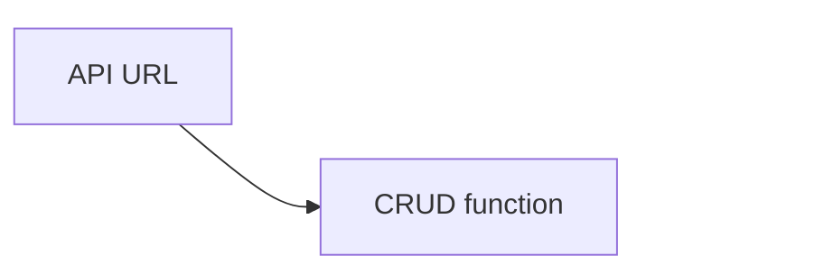


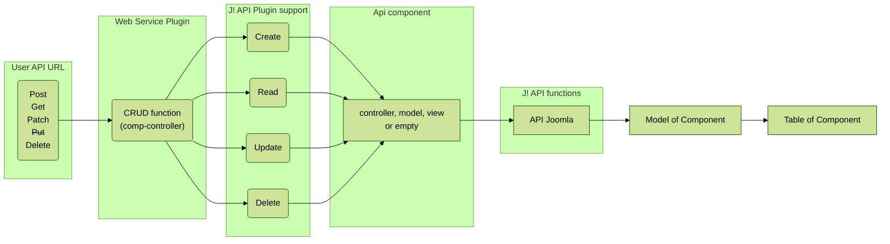


----

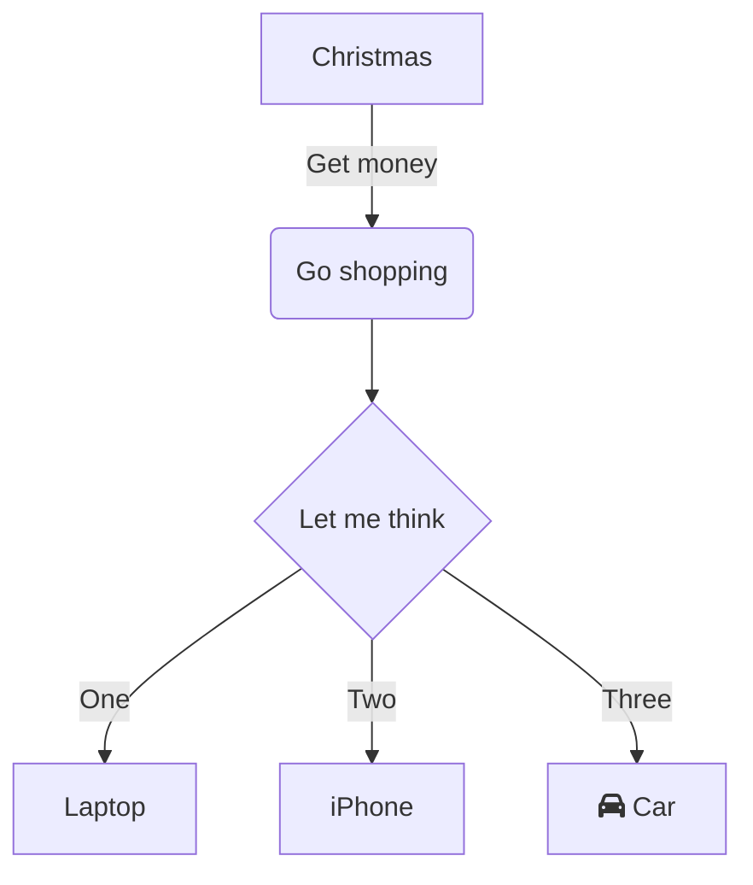


```


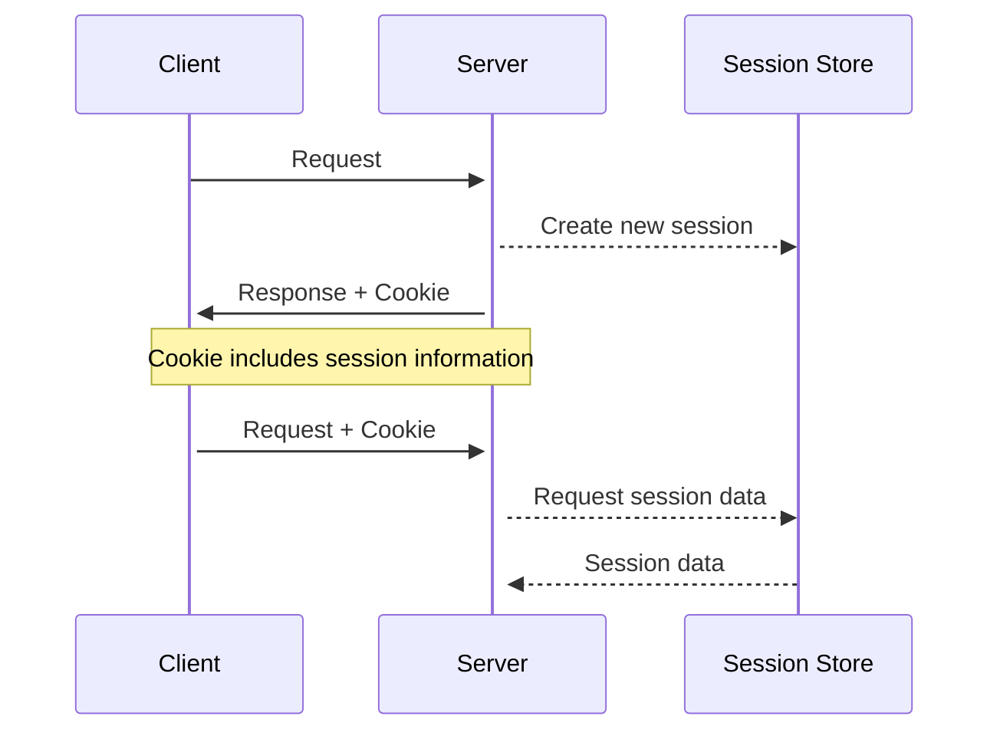

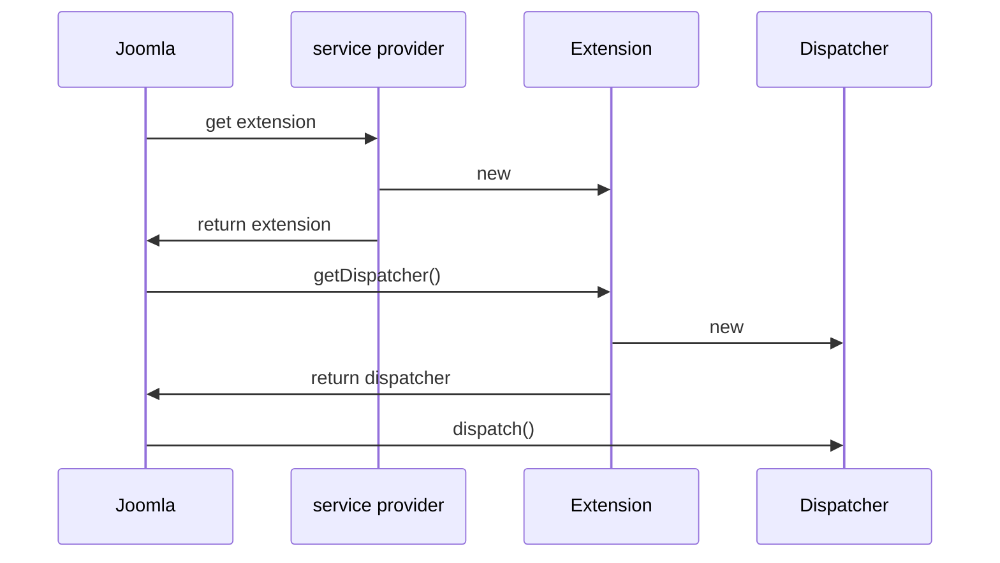


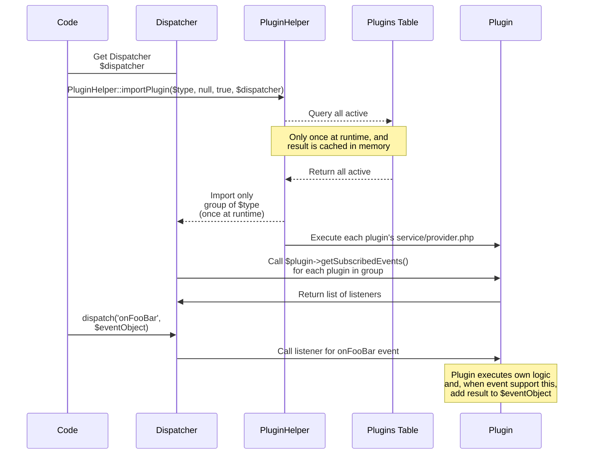

---
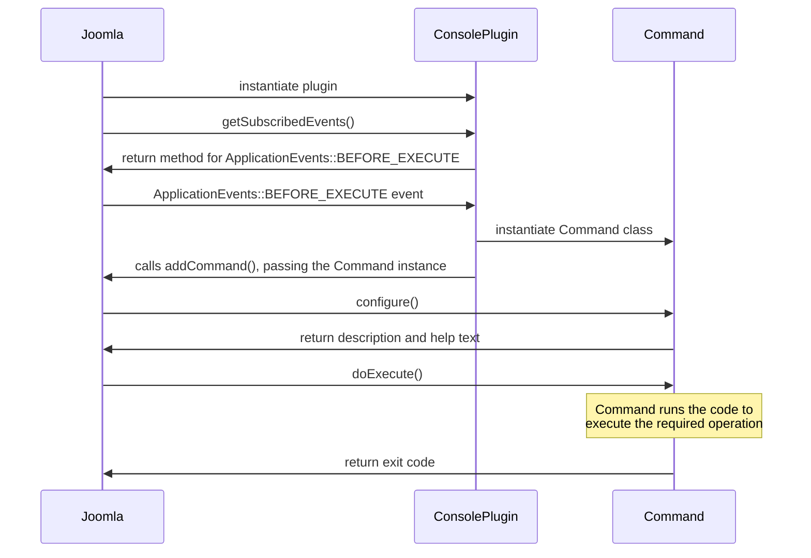


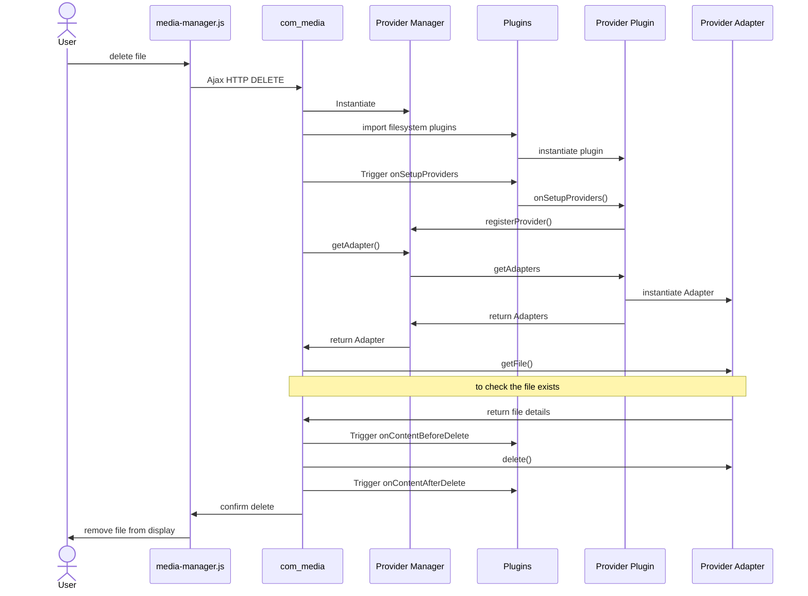

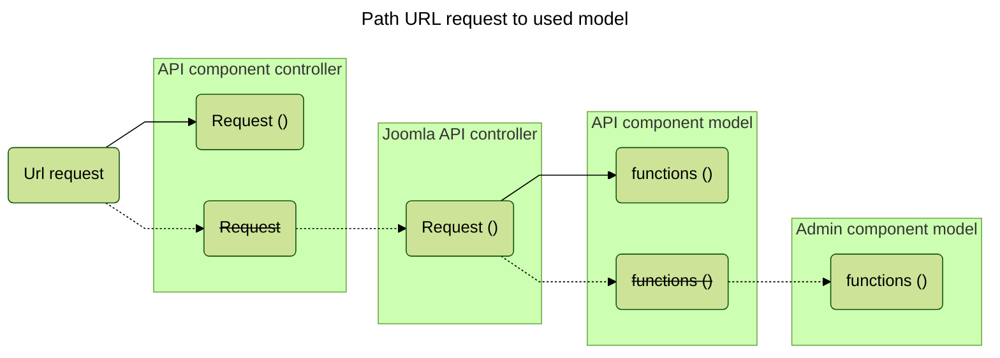
????

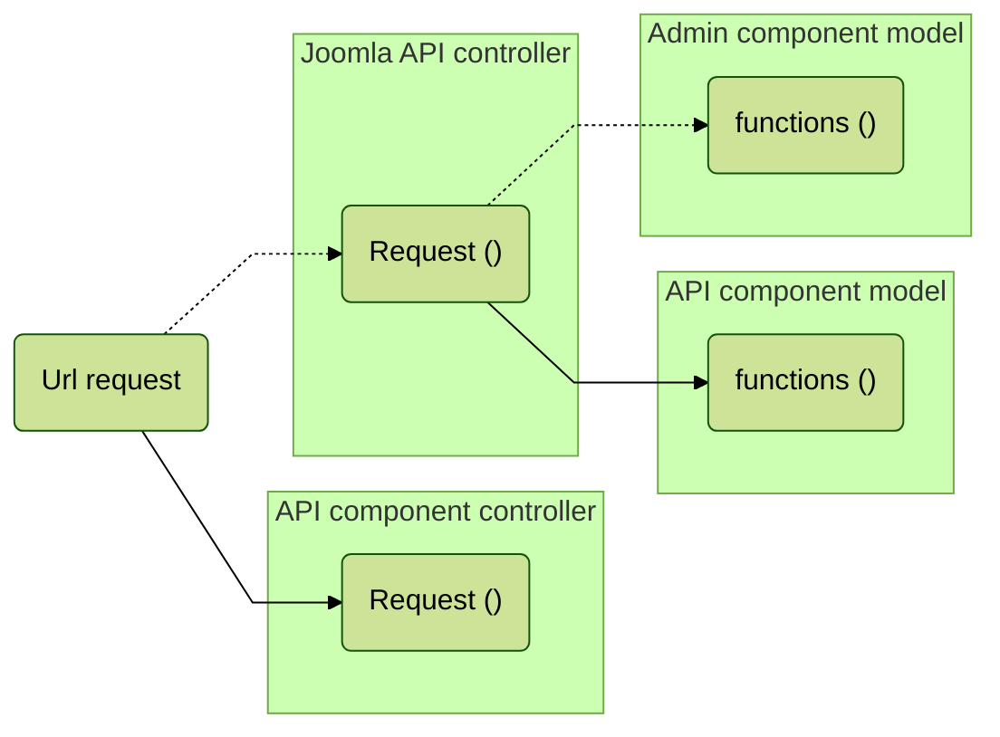


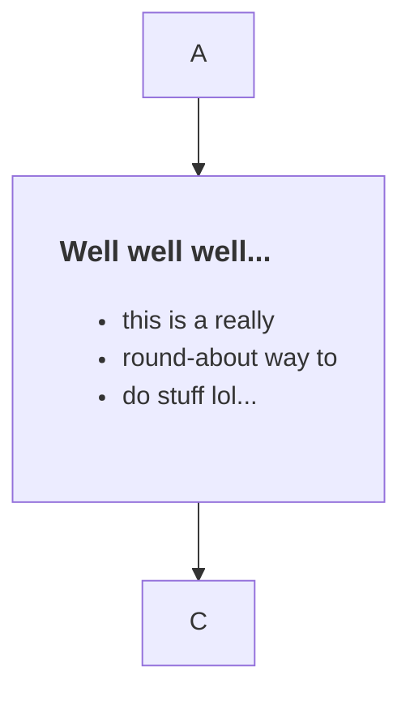

        "curve" : "basis"
        "curve" : "bumpX"
        "curve" : "bumpY"
        "curve" : "cardinal"
        "curve" : "catmullRom"
        "curve" : "linear"
        "curve" : "monotoneX"
        "curve" : "monotoneY"
        "curve" : "natural"
        "curve" : "step"
        "curve" : "stepAfter"
        "curve" : "stepBefore"
        
        
        "theme":"default",
        "theme":"forest",
        "theme":"base",
        "theme":"dark",
        "theme":"neutral",
        
        "useMaxWidth" : "true"
        "useMaxWidth" : "false"
        
        "diagramPadding" : "0",

        "diagramPadding" : "4",
        "diagramPadding" : "32",
        
        "noteSpacing" : "0",
        
        "rankSpacing" : "0",
        "rankSpacing" : "4",

          direction TB


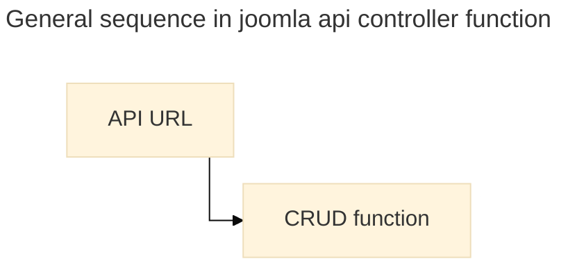


