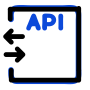

background-image: url(./assets/images/backgroundStructure_02.jpg)

## Artefacts with no meaning from here on ...

  

[//]: # (  )    
[//]: # (![logo2]&#40;../../icons/left_right.start.svg"&#41;)  

Test 02 ============  
 (1)  (2)  
 (5)  (6)  
 (7)  
===========
test after
===========

