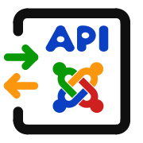

# Introduction component "com_secondhand"

Imagine a second hand books component with  
just the one books table and matching view.

Table items
- id
- name
- author
- isbn
- publish, created, ...

The idea is to use an external scan of the ISBN   
of the book, fetch book data by other web API   
and use a J! web API to fill this table.

---
## Which API routes do we want to expose ?

CRUD definitions (GET/POST/PATCH/DELETE)  
Which would look like following

| Command | Endpoint | Comment |
| ------- | ------------------------- | ------------------------------------ |
| GET | `v1/secondhand/books` | lists all books with variables |
| GET | `v1/secondhand/books/:id` | lists variables of book |
| POST | `v1/secondhand/books` | creates new book with data |
| PATCH | `v1/secondhand/books/:id` | writes parameters into selected book |
| DELETE | `v1/secondhand/books/:id` | deletes selected book |

---
            <h2> URL structure for Joomla API calls</h2>

Joomla API form:
<pre style="background-color: #ecf0f1; font-size: 14px; line-height: 1;"><strong>
example.com/api/index.php/v1/config/application?page[offset]=30&amp;page[limit]=30
\__________/\____________/\___________________/\_____________________________/
     |            |                 |                        |
    host       api path         endpoints                  query
</strong></pre>
 

    
<b>Api path:</b>

    <ul>
        <li style="text-align: left;">/api/index.php/                -&gt; webservice starting in web site `/api` folder </li>
    </ul>

 

    
<b>Endpoints:</b>

    <ul>
        <li> v1/config/application  -&gt; routes to address functionality</li>
    </ul>

 

    
<b>Query:</b>

    <ul>
        <li>pagination:   page[offset]=30&amp;page[limit]=30</li>
        <li>filter:                  filter[catid]=2&amp;filter[state]=1</li>
        <li>sorting:           list[ordering]=created&amp;list[direction]=desc</li>
        <li>fields:                fields[articles]=title,catid,state</li>
    </ul>

    
Special characters like '[' and ']' must be converted to '%5B' and '%5D' ...  
        like in other HTML queries

---

## end