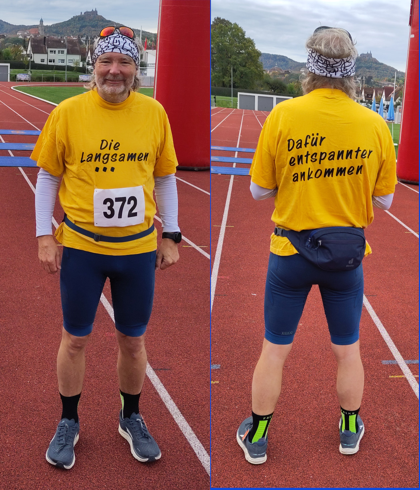
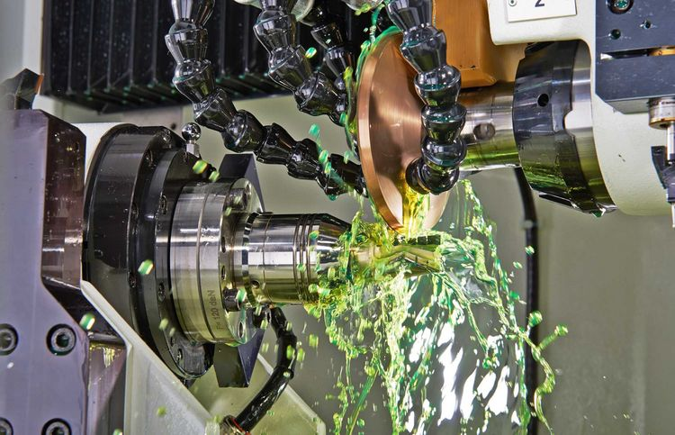

---
# try also 'default' to start simple
# xtheme: seriph
# xtheme: geist
# theme: light-icons
# xtheme: eloc
theme: default

# random image from a curated Unsplash collection by Anthony
# like them? see https://unsplash.com/collections/94734566/slidev
# background: https://cover.sli.dev
# some information about your slides (markdown enabled)
title: Web Services API - Implementation for components
info: |
  ## Web Services API - Implementation for components
  Dipping the toe into the sea of joomla webserverices API coding for components
# apply UnoCSS classes to the current slide
class: text-center
# https://sli.dev/features/drawing
drawings:
  persist: false
# slide transition: https://sli.dev/guide/animations.html#slide-transitions
transition: slide-left
# enable Comark Syntax: https://comark.dev/syntax/markdown
comark: true
# duration of the presentation
duration: 45min
# favicon, can be a local file path or URL
favicon: './assets/icons/favicon.svg'
---
				## Web Services API:<h3>Implementation for components</h3>

				

				### Dipping the toe into the sea of joomla webserverices API coding for components

				* Minimum component API code
				* Standard use of the component controller/models  <!-- .element: class="fragment" data-fragment-index="2" -->
				* Patch the data before reaching component controller/models <!-- .element: class="fragment" data-fragment-index="3" -->
				* Prepare the JSON response <!-- .element: class="fragment" data-fragment-index="4" -->

				The presentation is aimed at component developers who have no knowledge of Joomla's API functions.
# Thomas Finnern InsideTheMachine.de

### 2008: First Joomla! web page
Full moon fun run, no race,  once per month,  running up the hill

 
 
Using **RSGallery2** as my gallery for images

 

### 2013: RSGallery2 Missing support in 2013

* Founder with breakdown,  
* rsgallery2.net URL captured for money (1000$), 
* One person maintaining forum-server and  
* 1 person upgrading from J! 2.5 to 3.x
 
 

### 2014 Start of coding <!-- .element: class="fragment" data-fragment-index="2" -->

* Start of transfer code from 3x to 4x <!-- .element: class="fragment" data-fragment-index="2" -->
* Learning the ropes, first code in PHP .... <!-- .element: class="fragment" data-fragment-index="2" -->
* First joomla! Day / JCamp Essen <!-- .element: class="fragment" data-fragment-index="2" -->
 
 

### 2015 Transfer code to GitHub  <!-- .element: class="fragment" data-fragment-index="3" -->

* 2015: First release of RSG2 J4x <!-- .element: class="fragment" data-fragment-index="3" -->
* Website RSGallery2.org <!-- .element: class="fragment" data-fragment-index="3" -->
* RSG2 J4 state OK in 2019 <!-- .element: class="fragment" data-fragment-index="3" -->
 
 

### 2019++ Transition code to J5x

* Big ideas but failed due to j code expectations
* Gid instead of id, ignored categories ....
 
 

### 2025 First version for J5x <!-- .element: class="fragment" data-fragment-index="2" -->

Current status: <!-- .element: class="fragment" data-fragment-index="2" -->
It works "just barely", needs still a lot of development  <!-- .element: class="fragment" data-fragment-index="2" -->

 <!-- .element: class="fragment" data-fragment-index="3" -->

### 2024++ support for JoomGallery Friends <!-- .element: class="fragment" data-fragment-index="3" -->

* Code for site upload <!-- .element: class="fragment" data-fragment-index="3" -->
* Code for Web services API <!-- .element: class="fragment" data-fragment-index="3" -->
 
 

            <h2>Thomas Finnern</h2>
            <h3>Hobby</h3>
            

            

                

                     
                

                

                     
                

                

                     
                

            

            

            <h3>1999 - 2027 work at Walter Machines walter-machines.com</h3>
            

            

                

                     
                

                

                     
                

                

                     
                

            

            

## Location of code and a more detailed description

In this presentation the code is sown as shortened excerpt 

A complete version can be viewed at on my Github account: 

[https://github.com/ThomasFinnern/J_api_demo/tree/main/code](https://github.com/ThomasFinnern/J_api_demo/tree/main/code)

Parts of this presentation will be transferred to articles 
in [https://guide.joomla.org](https://guide.joomla.org)

    

