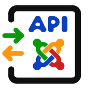
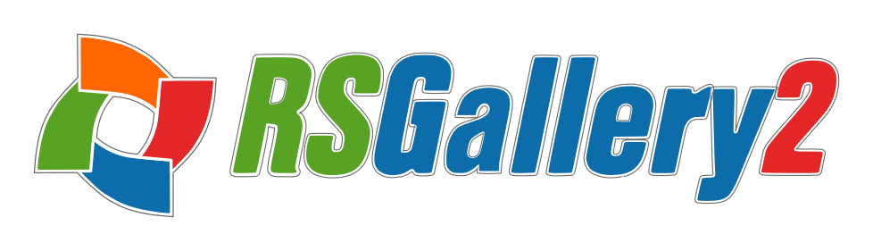

---
# try also 'default' to start simple
# xtheme: seriph
# xtheme: geist
# theme: light-icons
# xtheme: eloc
theme: default

# random image from a curated Unsplash collection by Anthony
# like them? see https://unsplash.com/collections/94734566/slidev
# background: https://cover.sli.dev
# some information about your slides (markdown enabled)
title: Web Services API - Implementation for components
info: |
  ## Web Services API - Implementation for components
  Dipping the toe into the sea of joomla webserverices API coding for components
# apply UnoCSS classes to the current slide
class: text-center
# https://sli.dev/features/drawing
drawings:
  persist: false
# slide transition: https://sli.dev/guide/animations.html#slide-transitions
transition: slide-left
# enable Comark Syntax: https://comark.dev/syntax/markdown
comark: true
# duration of the presentation
duration: 45min
# favicon, can be a local file path or URL
favicon: './assets/icons/favicon.svg'
---
## Web Services API:
## Implementation for components

 ### Dipping the toe into the sea of joomla webserverices API coding for components

 * Minimum component API code
 * Standard use of the component controller/modules  <!-- .element: class="fragment" data-fragment-index="2" -->
 * Patch the data before reaching component controller/modules <!-- .element: class="fragment" data-fragment-index="3" -->
 * Prepare the JSON response <!-- .element: class="fragment" data-fragment-index="4" -->

 The presentation is aimed at component developers who have no knowledge of Joomla's API functions.
---

## Thomas Finnern InsideTheMachine.de

### 2008: First Joomla! web page
Full moon fun run, no race, once per month, running up the hill

Using RSGallery2 as my gallery for images
 
### 2013: RSGallery2 Missing support in 2013
* Founder with breakdown, rsgallery2.net URL captured for money (1000$),
  one person maintaining forum-server and 1 person upgrading from J! 2.5 to 3.x

---

### 2014 Start of coding
* Start of transfer code from 3x to 4x
* Learning the ropes, first code in PHP ....
* First joomla! Day / JCamp Essen

## 2015 Transfer code to GitHub
* 2015: First release of RSG2 J4x
* Website RSGallery2.org
* RSG2 J4 state OK in 2019

## 2019++ Transition code to J5x
* Big ideas but failed due to j code expections
* Gid instead of id, ignored categories ....
